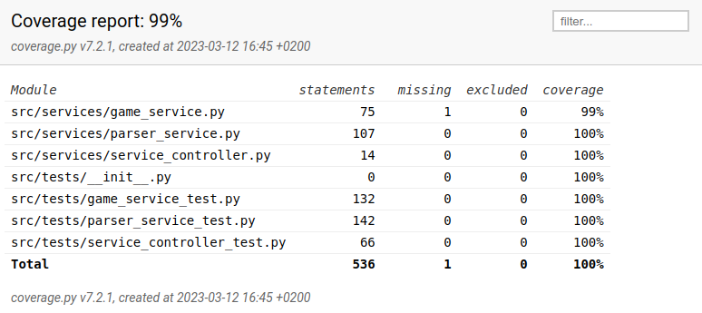

# Project notes

## Known issues

- Some code quality issues remain. Pylint score at the time of release 1.0 is 9.38.
- Y-coordinate values differentiate from LifeWiever. In this adaptation, y-values decrease when going downwards. This means that in this adaptation $y_{\text{this adaptation}} = -y_{\text{LifeViewer}}$. This however was a conscious design choice.

## Testing

The test coverage at the time of release 1.0 is $99\%$.

